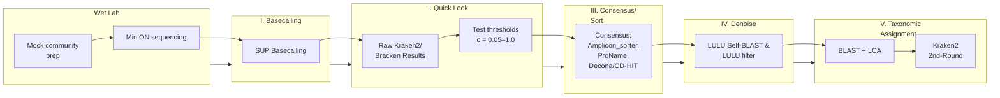

# DeCodeDNA

**Nanopore eDNA bioinformatics pipeline for FHL class 2025**

---

## Quick Start

### 1. Clone the repo
```bash
git clone https://github.com/pjedna/DeCodeDNA.git
```

### 2. Enter the project directory
```bash
cd DeCodeDNA
```

### 3. Create the Conda environment
```bash
conda env create -f environment.yml
```

### 4. Activate the environment
```bash
conda activate decode-dna
```

### 5. Run the first step (basecalling) on our example data
```bash
bash scripts/01_basecall.sh data/example_fast5/ results/fast5/
```

---

## Pipeline Workflow Overview



## Pipeline Steps

### Step I: Basecalling
- **Input**: Raw MinION sequencing data (FAST5/POD5)
- **Process**: SUP (Super Accurate) basecalling using Guppy or Dorado
- **Output**: High-quality FASTQ sequences

### Step II: Quick Look
- **Input**: Basecalled FASTQ files
- **Process**: Initial taxonomic classification using Kraken2/Bracken
- **Output**: Preliminary species identification and abundance estimates
- **Quality Control**: Test multiple confidence thresholds (c = 0.05-1.0)

### Step III: Consensus/Sort
- **Input**: Classified sequences
- **Process**: Sequence clustering and consensus building
- **Tools**: Amplicon_sorter, ProName, Decona/CD-HIT/OBITools
- **Output**: Clustered sequences representing species/taxa

### Step IV: Denoise
- **Input**: Clustered sequences
- **Process**: Remove sequencing artifacts and low-abundance variants
- **Method**: LULU algorithm with self-BLAST filtering
- **Output**: Clean, high-confidence sequence clusters

### Step V: Taxonomic Assignment
- **Input**: Denoised sequence clusters
- **Process**: Final taxonomic classification using multiple approaches
- **Methods**: 
  - BLAST + LCA (Lowest Common Ancestor)
  - Kraken2 second-round classification
- **Output**: Final species identification and abundance matrix

## Requirements

- **Conda/Mamba**: For environment management
- **MinION data**: FAST5 or POD5 files from Oxford Nanopore sequencing
- **Reference databases**: Kraken2/Bracken databases for taxonomic classification
- **Computational resources**: Recommended 8+ cores, 32+ GB RAM

## Installation

1. Clone this repository
2. Create the conda environment using the provided `environment.yml`
3. Activate the environment
4. Download required databases (instructions in `/databases/README.md`)

## Usage

Run the pipeline step by step using the provided scripts in the `/scripts/` directory:

```bash
# Step 1: Basecalling
bash scripts/01_basecall.sh [input_directory] [output_directory]

# Step 2: Quick taxonomic look
bash scripts/02_quick_look.sh [fastq_directory] [output_directory]

# Step 3: Consensus and sorting
bash scripts/03_consensus.sh [input_directory] [output_directory]

# Step 4: Denoising
bash scripts/04_denoise.sh [input_directory] [output_directory]

# Step 5: Final taxonomic assignment
bash scripts/05_taxonomy.sh [input_directory] [output_directory]
```

## Output Structure

```
results/
├── 01_basecalling/     # FASTQ files from basecalling
├── 02_quick_look/      # Initial Kraken2/Bracken results
├── 03_consensus/       # Clustered sequences
├── 04_denoised/        # Clean sequence clusters
├── 05_taxonomy/        # Final taxonomic assignments
└── final_report/       # Summary statistics and visualizations
```

## Citation

If you use DeCodeDNA in your research, please cite:

```
DeCodeDNA: Nanopore eDNA bioinformatics pipeline
FHL Class 2025
GitHub: https://github.com/pjedna/DeCodeDNA
```

## License

This project is licensed under the MIT License - see the LICENSE file for details.

## Contributing

1. Fork the repository
2. Create a feature branch
3. Make your changes
4. Submit a pull request

## Support

For questions or issues, please contact the development team at ednacollab@uw.edu

---

**Developed for Friday Harbor Labs eDNA Course 2025**
