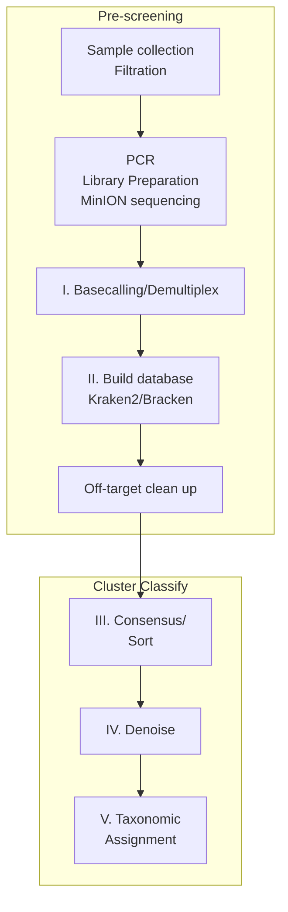

# DeCodeDNA

**Nanopore eDNA bioinformatics pipeline for FHL class 2025**

---

## What is DeCodeDNA?

DeCodeDNA is a turnkey Nanopore metabarcoding pipeline designed for Friday Harbor Labs’ eDNA course conducted by the eDNA Collaborative.  
From raw POD5 basecalling all the way through consensus calling, LULU‐denoising and taxonomic assignment, you get:

- **Directions on basecalling depending on the local machine's specifications** via Dorado  
- **Rapid classification and cleanup** (Kraken2 → Bracken → threshold testing and cleanup)  
- **Consensus building** across replicates with Amplicon_sorter or CD-HIT  
- **Artifact removal** using the LULU R package  
- **Final taxonomic calls** with both BLAST+LCA and/or Kraken2-second-round  

It starts on GUI, runs on command line, handles multiplexed COI or 12S amplicons, works on any modern laptop or server, and ships with a tiny “mock” sample so you can test end-to-end.

---

## Quick Start

### 1. Clone the repo
```bash
git clone https://github.com/pjedna/DeCodeDNA.git
```

### 2. Enter the project directory
```bash
cd DeCodeDNA
```

### 3. Create the Conda environment
```bash
conda env create -f environment.yml
```

### 4. Activate the environment
```bash
conda activate decode-dna
```

### 5. Run the first step (basecalling) on our example data
```bash
bash scripts/01_basecall.sh data/example_pod5/ results/pod5/
```

---

## Dependencies

### (A) Automated via Conda

We recommend Conda for a one-line install:

```bash
conda env create -f environment.yml
conda activate decode-dna
```

### (B) Manual installation

| Tool            | Version | Install command                                                          | Purpose                                   |
|-----------------|:-------:|--------------------------------------------------------------------------|-------------------------------------------|
| Dorado          |  0.9.1  | `conda install -c bioconda dorado`                                       | SUP basecalling                           |
| Cutadapt        |   4.8   | `conda install cutadapt`                                                 | Primer trimming                           |
| NanoFilt        |  2.8.0  | `conda install nanofilt`                                                 | Quality & length filtering                |
| VSEARCH         | 2.21.0  | `conda install vsearch`                                                  | Clustering & self-BLAST                   |
| CD-HIT          |  4.8.1  | `conda install cd-hit`                                                   | Sequence clustering                       |
| Kraken2         |  2.1.2  | `conda install kraken2`                                                  | Taxonomic classification                  |
| Bracken         |   2.7   | `conda install bracken`                                                  | Abundance re-estimation                   |
| BLAST           | 2.15.0  | `conda install blast`                                                    | Alignment + Lowest Common Ancestor (LCA)  |
| TaxonKit        | 0.10.1  | `conda install taxonkit`                                                 | Compute LCA from taxon IDs                |
| Amplicon_sorter |    —    | `conda install amplicon_sorter`                                          | Consensus sequence calling                |
| ProName         |    —    | `conda install proname`                                                  | Label consensus clusters                  |
| OBITools        |    —    | `conda install obitools`                                                 | FASTA/Q utilities (optional)              |
| SeqKit          |    —    | `conda install seqkit`                                                   | FASTA/Q utilities                         |
| ONTbarcoder     |   2.3   | Download & unzip from GitHub Releases: <br/>`https://github.com/asrivathsan/ONTbarcoder/releases` | Demultiplex custom CCI barcodes           |
| MinKNOW         | 25.03.9 | Install via Oxford Nanopore Community site: <br/>`https://community.nanoporetech.com`                | Sequencer control & live basecalling      |

---

## Pipeline Workflow Overview



## Pipeline Steps

### Step I: Basecalling and demultiplexing
- **Input**: Raw MinION sequencing data (POD5)
- **Process 1**: SUP (Super Accurate) basecalling and demultiplex native barocdes using Dorado<br>https://github.com/nanoporetech/dorado
- **Process 2**: Demultiplex custom CCI barcodes with ONTbarcoder2.3, https://github.com/asrivathsan/ONTbarcoder/releases; see CCI indexing at 
- **Output**: High-quality FASTQ sequences

### Step II: Quick Look
- **Input**: Basecalled and demultiplexed FASTQ files
- **Process**: Initial taxonomic classification using Kraken2/Bracken
- **Output**: Preliminary species identification and abundance estimates
- **Target Control**: Off-target clean up, use classified sequences for downstream analyses

### Step III: Consensus/Sort
- **Input**: Classified sequences
- **Process**: Sequence consensus calling and building
- **Tools**: Amplicon_sorter, Decona/CD-HIT/OBITools4
- **Output**: Consensus sequences representing taxa amplicon sequence variants (ASVs)

### Step IV: Denoise
- **Input**: Consensus sequences (ASVs)
- **Process**: Remove sequencing artifacts and low-abundance variants
- **Method**: LULU algorithm with self-BLAST/VSEARCH filtering
- **Output**: Clean, high-confidence sequence clusters, operational taxonomic units (OTUs)

### Step V: Taxonomic Assignment
- **Input**: Denoised sequence clusters (OTUs)
- **Process**: Final taxonomic classification using multiple approaches
- **Methods**: 
  - BLAST + LCA (Lowest Common Ancestor)
  - Kraken2 second-round classification
- **Output**: Final species identification and abundance matrix

## Requirements

- **Conda**: For environment management
- **MinION data**: FAST5 or POD5 files from Oxford Nanopore sequencing
- **Reference databases**: Kraken2)(e.g. Mitofish, core_nt/Bracken databases for taxonomic classification
- **Computational resources**: Recommended 8+ cores, 32+ GB RAM

## Installation

1. Clone this repository
2. Create the conda environment using the provided `environment.yml`
3. Activate the environment
4. Download required databases (instructions in `/databases/README.md`)

## Usage

Run the pipeline step by step using the provided scripts in the `/scripts/` directory:

```bash
# Step 1: Basecalling
bash scripts/01_basecall.sh [input_directory] [output_directory]

# Step 2: Quick taxonomic look
bash scripts/02_quick_look.sh [fastq_directory] [output_directory]

# Step 3: Consensus and sorting
bash scripts/03_consensus.sh [input_directory] [output_directory]

# Step 4: Denoising
bash scripts/04_denoise.sh [input_directory] [output_directory]

# Step 5: Final taxonomic assignment
bash scripts/05_taxonomy.sh [input_directory] [output_directory]
```

## Output Structure

```
results/
├── 01_basecalling/     # FASTQ files from basecalling
├── 02_quick_look/      # Initial Kraken2/Bracken results
├── 03_consensus/       # Clustered sequences
├── 04_denoised/        # Clean sequence clusters
├── 05_taxonomy/        # Final taxonomic assignments
└── final_report/       # Summary statistics and visualizations
```

## Citation

If you use DeCodeDNA in your research, please cite:

```
DeCodeDNA: Nanopore eDNA bioinformatics pipeline
FHL Class 2025
GitHub: https://github.com/pjedna/DeCodeDNA
```

## License

This project is licensed under the MIT License - see the LICENSE file for details.

## Contributing

1. Fork the repository
2. Create a feature branch
3. Make your changes
4. Submit a pull request

## Support

For questions or issues, please contact the development team at ednacollab@uw.edu

---

**Developed for Friday Harbor Labs eDNA Course 2025**
