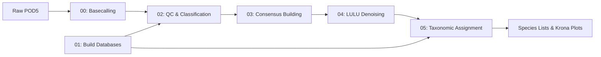

# DeCodeDNA

**Oxford Nanopore eDNA Metabarcoding Pipeline for FHL Class 2025**

A complete, educational bioinformatics pipeline for analyzing environmental DNA (eDNA) using Oxford Nanopore long-read sequencing technology. Designed for Friday Harbor Labs' eDNA course by the eDNA Collaborative.

---

## 🧬 What is DeCodeDNA?

DeCodeDNA transforms raw Oxford Nanopore sequencing data into species identification and abundance estimates. From raw POD5 basecalling through consensus calling, LULU‐denoising and taxonomic assignment, you get publication-ready results with educational insights at every step.

**Key Features:**
- 🚀 **Smart basecalling** adapted to local machine specs
- 🔬 **Dual clustering approaches** (fast vsearch + thorough amplicon_sorter)  
- 🧹 **LULU denoising** with co-occurrence filtering
- 📊 **Method comparisons** (BLAST vs Kraken2, multiple databases)
- 🎓 **Educational focus** with timing estimates and explanations
- 📱 **Interactive visualizations** via Krona plots

---

## 🚀 Quick Start

### 1. Install
```bash
# Clone and setup (5 minutes)
git clone https://github.com/piedna/DeCodeDNA.git
cd DeCodeDNA && chmod +x scripts/*.sh
conda env create -f environment.yml
conda activate decode-dna
```

### 2. Test with Mock Data
```bash
# Run complete pipeline (15 minutes)
bash scripts/02_quick_look_clean.sh mock/ results/02_quicklook
bash scripts/03_consensus_sort.sh results/02_quicklook results/03_consensus  
bash scripts/04_denoise.sh results/03_consensus results/04_denoise
bash scripts/05_taxonomic_assignment.sh results/04_denoise results/05_taxonomy
```

### 3. View Results
Open `results/05_taxonomy/04_krona_plots/*.html` in your browser!

📖 **Need detailed setup?** → See [`installation_guide.md`](installation_guide.md)

📋 **Verify installation?** → Run `bash scripts/check_installation.sh`

---

## 🔄 Pipeline Overview



**Educational Comparisons Built-In:**
- **Clustering:** vsearch (fast) vs amplicon_sorter (thorough)
- **Classification:** BLAST (similarity) vs Kraken2 (k-mer)
- **Databases:** 12S vs COI vs MitoFish
- **Visualization:** Multiple interactive Krona plots

---

## 📜 Pipeline Scripts

The pipeline consists of 6 main scripts that can be run sequentially or independently:

### Script 00: Basecalling Demo
**`00_basecall_and_demux.sh`** - Oxford Nanopore basecalling demonstration
- **Purpose:** Educational showcase of basecalling process
- **What it does:** Downloads models, converts FAST5→POD5, demonstrates GPU vs CPU basecalling
- **When to use:** Optional demo for understanding ONT basecalling workflow
- **Output:** Basecalled FASTQ files for comparison

### Script 01: Database Builder  
**`01_build_dbs_kraken_blastn.sh`** - Reference database construction
- **Purpose:** One-time setup to build all reference databases
- **What it does:** Downloads MIDORI and MitoFish sequences, builds BLAST and Kraken2 databases
- **When to use:** Once before running taxonomic assignment (Script 05)
- **Output:** Ready-to-use databases in `../databases/`

### Script 02: Quality Control & Classification
**`02_quick_look_clean.sh`** - Initial processing and quality filtering
- **Purpose:** Clean sequences and get first taxonomic overview
- **What it does:** Quality filtering, length filtering, initial Kraken2 classification
- **Input:** Raw FASTQ files (from basecalling or mock data)
- **Output:** Filtered sequences, classification reports, length distributions

### Script 03: Consensus Building
**`03_consensus_sort.sh`** - Dual clustering approach demonstration
- **Purpose:** Compare two clustering methods for consensus generation
- **What it does:** 
  - **vsearch:** Fast local clustering (runs automatically)
  - **amplicon_sorter:** Advanced clustering (demo command provided)
- **Input:** Classified sequences from Script 02
- **Output:** Consensus sequences from both methods

### Script 04: LULU Denoising
**`04_denoise.sh`** - Error correction and artifact removal
- **Purpose:** Remove sequencing errors and PCR artifacts using LULU algorithm
- **What it does:** Self-BLAST alignment, co-occurrence analysis, OTU curation
- **Input:** Consensus sequences from Script 03  
- **Output:** Curated OTU tables, cleaned representative sequences

### Script 05: Taxonomic Assignment
**`05_taxonomic_assignment.sh`** - Final species identification and visualization
- **Purpose:** Comprehensive taxonomic assignment with method comparison
- **What it does:**
  - **BLAST:** Similarity-based assignment against multiple databases
  - **Kraken2:** K-mer based classification  
  - **Krona plots:** Interactive taxonomic visualizations
- **Input:** Denoised sequences from Script 04
- **Output:** Species abundance tables, comparison matrices, Krona plots

---

## 📊 What You Get

### Method Comparisons
- **Multiple clustering methods:** vsearch vs amplicon_sorter
- **Multiple classification methods:** BLAST vs Kraken2  
- **Multiple databases:** 12S vs COI vs MitoFish

### Key Result Files
- `results/05_taxonomy/03_final_taxonomy/Final_*_*_6columns.csv` - Species abundance matrices comparing both methods
- `results/05_taxonomy/04_krona_plots/*.html` - Interactive taxonomic visualizations
- `results/05_taxonomy/03_final_taxonomy/Overall_Method_Comparison.csv` - BLAST vs Kraken2 performance summary

---

## 🎓 Educational Features

### 📁 Mock Data Included
Ready-to-use 12S fish community dataset with 200K reads per sample:
```
mock/
├── fast5/                          # Legacy FAST5 files (educational)
├── pod5_barcode50/                 # Modern POD5 files (for basecalling demo)
├── test_fhl_200k_1.fastq          # Sample replicate 1 (~200k reads)
├── test_fhl_200k_2.fastq          # Sample replicate 2  
├── test_fhl_200k_3.fastq          # Sample replicate 3
└── mock_amplicon_sorter_clustered_consensus_*.fasta  # Pre-computed server results
```

### ⏱️ Realistic Timing
- **Pipeline execution:** 15-25 minutes on mock data
- **Individual steps:** 3-10 minutes each
- **Database building:** 1.5 hours (one-time setup)

### 🔬 Method Comparisons
- **Performance:** GPU vs CPU basecalling
- **Accuracy:** Multiple taxonomic databases
- **Speed:** Local vs server-optimized processing

---

## 💻 Usage

### Classroom Workflow
```bash
conda activate decode-dna
bash scripts/02_quick_look_clean.sh mock/ results/02_quicklook
bash scripts/03_consensus_sort.sh results/02_quicklook results/03_consensus  
bash scripts/04_denoise.sh results/03_consensus results/04_denoise
bash scripts/05_taxonomic_assignment.sh results/04_denoise results/05_taxonomy
```

### Real Data Workflow
```bash
# 1. Build databases (one-time)
bash scripts/01_build_dbs_kraken_blastn.sh

# 2. Basecalling (optional - can be done on server/gaming laptop)
bash scripts/00_basecall_and_demux.sh

# 3. Demultiplexing with ONTbarcoder2.3 (GUI application)
# Use demultiplex sheet with 5 columns:
# sample_name, forward_tag, reverse_tag, forward_primer, reverse_primer
# Example:
# 1_mifish_chelexFN_a,CCATTGTATAAACC,CCATTGTATAAACC,GCCGGTAAAACTCGTGCCAGC,CATAGTGGGGTATCTAATCCCAGTTTG
# 2_mifish_chelex1_a,CCGTATAGAGTACC,CCGTATAGAGTACC,GCCGGTAAAACTCGTGCCAGC,CATAGTGGGGTATCTAATCCCAGTTTG

# Fix ONTbarcoder output (if needed)
bash scripts/EFPQ_ontbarcoder_convert.sh

# 4. Process your demultiplexed data
bash scripts/02_quick_look_clean.sh your_fastq_dir/ results/02_quicklook
# ... continue with steps 3-5
```

📖 **ONTbarcoder2.3 detailed usage:** https://github.com/asrivathsan/ONTbarcoder/releases

### Customization
```bash
# Faster for teaching
export SUBSET_COUNT=1000
export THREADS=4

# Different quality thresholds
export QUALITY_THRESHOLD=15
export MIN_LENGTH=200
```

---

## 🛠️ Requirements

- **OS:** macOS or Linux
- **RAM:** 8GB minimum, 16GB+ recommended
- **Storage:** 10GB+ free space
- **Dependencies:** Managed via conda (see `environment.yml`)

---

## 📚 Documentation

- 📖 **[Installation Guide](installation_guide.md)** - Detailed setup instructions
- 🔬 **[Scientific Background](docs/scientific_background.md)** - Pipeline methodology
- 🎓 **[Teaching Notes](docs/teaching_notes.md)** - Classroom guidance
- 🔧 **[Troubleshooting](docs/troubleshooting.md)** - Common issues and solutions

---

## 📄 Citation

```bibtex
@software{decodedna2025,
  title={DeCodeDNA: Oxford Nanopore eDNA Metabarcoding Pipeline},
  author={Ip, Y.C.A. and The eDNA Collaborative},
  year={2025},
  url={https://github.com/piedna/DeCodeDNA}
}
```

---

## 📞 Support

- 📖 **Installation help:** [`installation_guide.md`](installation_guide.md)
- 🐛 **Issues:** [GitHub Issues](https://github.com/piedna/DeCodeDNA/issues)
- 📧 **Course questions:** `ednacollab@uw.edu`

---

**Developed for Friday Harbor Labs eDNA Course 2025**  
*Making eDNA analysis accessible, educational, and reproducible*