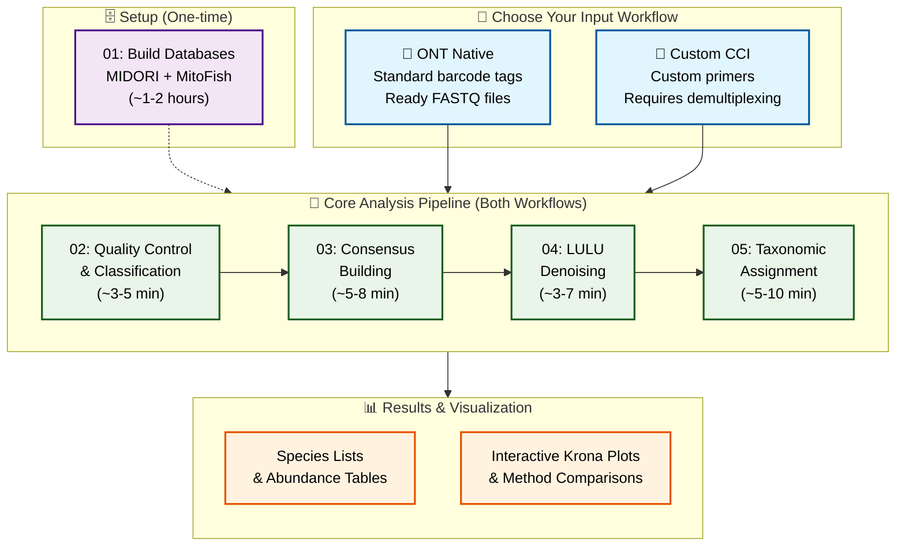

# DeCodeDNA

**Oxford Nanopore eDNA Metabarcoding Pipeline for Friday Harbor Lab Class 2025**

A complete, educational bioinformatics pipeline for analyzing environmental DNA (eDNA) using Oxford Nanopore long-read sequencing technology. Designed for Friday Harbor Labs' (FHL) eDNA summer course by [The eDNA Collaborative](https://www.ednacollab.org)

---

## 🧬 What is DeCodeDNA?

DeCodeDNA transforms raw Oxford Nanopore sequencing data into species identification and abundance estimates. From raw POD5 basecalling through consensus calling, LULU‐denoising and taxonomic assignment, you get OTU tables and visual plot results with educational insights at every step.

**Key Features:**
- 🚀 **Two complete workflows** for ONT Native and Custom CCI barcode tags
- 🔬 **Dual clustering approaches** (fast vsearch + thorough, ONT-suited amplicon_sorter)  
- 🧹 **LULU denoising** with co-occurrence filtering
- 📊 **Method comparisons** (BLAST vs Kraken2, multiple databases)
- 🎓 **Educational focus** with timing estimates and explanations
- 📱 **Interactive visualizations** via Krona plots

---

## 🔬 Pipeline Overview



**Pipeline Scripts:**
- **Script 00:** Quality filtering for Custom CCI (recommended before demultiplexing)
- **Script 01:** Database building (one-time setup)
- **Scripts 02-05:** Core analysis pipeline (both workflows)

---

## 🔄 Choose Your Workflow

DeCodeDNA supports **two distinct barcode tag approaches**. Choose the one that matches your PCR and sample multiplexing setup:

### 🔹 Workflow A: ONT Native Barcode Tags
**For samples using Oxford Nanopore's official barcode tag kits**
- Uses ONT Native Barcode Tag Kits (NBD114.96, PBC096, etc.)
- Samples are already demultiplexed during basecalling
- **Best for**: Two-step PCR workflows, users who don't design their own sample multiplexing
- **Mock data**: 12S fish community dataset (~200-300bp amplicons)

```bash
# Quick start - ONT Native Workflow
bash scripts/02_quick_look_clean.sh workflows/ont_native_barcodes results/ont_native_02_quicklook
# Continue with scripts 03, 04, 05...
```

### 🔹 Workflow B: Custom CCI Barcode Tags  
**For samples using custom primer-barcode tag combinations**
- **Recommended**: Quality filtering before demultiplexing improves accuracy
- Requires manual demultiplexing with ONTbarcoder2.3 GUI
- Includes quality filtering and EFPQ base conversion
- **Best for**: One-step PCR workflows, custom primer designs, research applications
- **Mock data**: 2500bp D-loop fish dataset (mitochondrial control region)

```bash
# Complete custom CCI workflow
# Step 1: Quality filter raw data (RECOMMENDED - improves demultiplexing accuracy)
bash scripts/00_quality_filter_predemux.sh workflows/custom_cci_barcodes/00_raw_data/test_fhl_customcci.fastq

# Step 2: Manual demultiplexing practice (GUI)
# Use ONTbarcoder2.3 with workflows/custom_cci_barcodes/demux_config/quality_filtered.fastq
# Output to: workflows/custom_cci_barcodes/02_demultiplexed_demo/ (PRACTICE ONLY)

# Step 3: Continue with core pipeline using robust mock data
bash scripts/02_quick_look_clean.sh workflows/custom_cci_barcodes/02_demultiplexed/demultiplexed/ results/custom_cci_02_quicklook
# Continue with scripts 03, 04, 05...
```

**📖 Detailed workflow instructions:** [ONT Native README](workflows/ont_native_barcodes/README_ont_native.md) | [Custom CCI README](workflows/custom_cci_barcodes/README_custom_cci.md)

---

## 🛠️ Installation

### Quick Setup (5-10 minutes)
```bash
# 1. Clone repository
git clone https://github.com/piedna/DeCodeDNA.git
cd DeCodeDNA

# 2. Create conda environment
conda env create -f environment.yml
conda activate decode-dna

# 3. Setup tools and databases
bash scripts/install_krona_taxonomy.sh
bash scripts/install_R_dependencies.sh
bash scripts/install_external_tools.sh

# 4. Setup databases (choose one option)
# Option A: Use pre-built databases (classroom - recommended)
source scripts/setup_databases.sh

# Option B: Build databases from scratch (1-2 hours, ~200GB disk space)
bash scripts/01_build_dbs_kraken_blastn.sh
```

### Database Setup Options

**For FHL Students:**
- **Try Option B first** (build your own) - great learning experience
- **Fallback to Option A** if you lack disk space (~200GB needed)
- **Pre-loaded USB drives available** - we'll pass these around class
- Building databases yourself helps understand the reference data structure

**Database Requirements:**
- **Disk Space**: ~200GB for complete local setup
- **Time**: 1-2 hours for initial build
- **Internet**: Required for downloading reference sequences
- **Alternative**: Use shared USB drives (no local storage needed)

**💡 Detailed installation guide:** [`installation_guide.md`](installation_guide.md)

---

## 🎓 For Students: Course Progression

### Learning Path for FHL Course

**📋 Course Workflow Strategy:**
1. **Start with Workflow A (ONT Native)** → Learn pipeline basics with 12S mock data
2. **Practice with Workflow B mock data** → Understand custom CCI processing with 2500bp D-loop data 
3. **Apply Workflow B to real samples** → Analyze your actual field collections

### Which Mock Data to Use?

**Workflow A Mocks** (Learning the pipeline):
- **12S fish community dataset** (~200-300bp amplicons)
- Uses pre-demultiplexed data (easier to start)
- Multiple file sizes for different exercises (100K, 150K, 200K reads)
- Focus on understanding analysis steps
- Perfect for first-time users
- **amplicon_sorter pre-computed results available** in `workflows/ont_native_barcodes/precomputed/`

**Workflow B Mocks** (Practice custom workflow):
- **2500bp D-loop fish dataset** (mitochondrial control region)
- Includes demultiplexing step with ONTbarcoder2.3 GUI
- Learn custom primer-barcode tag handling
- Prepare for real sample analysis

**Real Samples** (Final analysis):
- Use Workflow B for your field collections
- Apply everything you've learned
- **amplicon_sorter recommended** for final research results

### Common Commands

**📜 Pipeline Scripts Explained:**

**ONT Native Workflow (Learning with 12S data):**
```bash
# Script 02: Quality Control & Classification (~3-5 minutes)
# • Quality filtering, length filtering, initial Kraken2 classification
# • Input: Raw FASTQ files | Output: Filtered sequences, classification reports
bash scripts/02_quick_look_clean.sh workflows/ont_native_barcodes results/ont_native_02_quicklook

# Script 03: Consensus Building (~5-8 minutes)
# • vsearch: Fast local clustering | amplicon_sorter: Advanced clustering (demo)
# • Input: Classified sequences | Output: Consensus sequences from both methods
bash scripts/03_consensus_sort.sh results/ont_native_02_quicklook results/ont_native_03_consensus

# Script 04: LULU Denoising (~3-7 minutes)
# • Remove sequencing errors using LULU algorithm
# • Input: Consensus sequences | Output: Curated OTU tables, cleaned sequences
bash scripts/04_denoise.sh results/ont_native_03_consensus results/ont_native_04_denoise

# Script 05: Taxonomic Assignment (~5-10 minutes)
# • BLAST + Kraken2 classification, Krona visualizations
# • Input: Denoised sequences | Output: Species tables, interactive plots
bash scripts/05_taxonomic_assignment.sh results/ont_native_04_denoise results/ont_native_05_taxonomy
```

**Custom CCI Workflow (Real samples with 2500bp D-loop data):**
```bash
# Step 0: Quality filter before demultiplexing (RECOMMENDED)
bash scripts/00_quality_filter_predemux.sh workflows/custom_cci_barcodes/00_raw_data/test_fhl_customcci.fastq

# Then: Same script progression (02→03→04→05) but with custom CCI data
bash scripts/02_quick_look_clean.sh workflows/custom_cci_barcodes/02_demultiplexed/demultiplexed/ results/custom_cci_02_quicklook
bash scripts/03_consensus_sort.sh results/custom_cci_02_quicklook results/custom_cci_03_consensus
bash scripts/04_denoise.sh results/custom_cci_03_consensus results/custom_cci_04_denoise
bash scripts/05_taxonomic_assignment.sh results/custom_cci_04_denoise results/custom_cci_05_taxonomy
```

**Total Pipeline Time:** 15-25 minutes for mock data

---

## 📊 Expected Results

### File Outputs
```
results/
├── [workflow]_results/
│   ├── 02_quicklook/               # Quality control & initial classification
│   ├── 03_consensus/               # Sequence clustering results
│   ├── 04_denoise/                 # Error-corrected sequences
│   │   └── [database]/             # Database-specific results
│   │       └── otu_representatives_[database]_vsearch.fasta  # ⭐ Filtered consensus sequences
│   └── 05_taxonomy/                # Final species identification
│       ├── 03_final_taxonomy/      # Species abundance tables ⭐
│       └── 04_krona_plots/         # Interactive visualizations ⭐
```

### Key Result Files
- **Consensus sequences**: `04_denoise/*/otu_representatives_*_vsearch.fasta` - Filtered sequences ready for custom analysis (haplotyping, phylogenetics)
- **Species tables**: `*_classified_species.csv` - Final abundance matrices
- **TaxonKit LCA results**: `TaxonKit_LCA_species_abundance.csv` - Most robust consensus taxonomy
- **Interactive plots**: `*_krona_plot.html` - Open in browser for exploration
- **Method comparison**: `Overall_Method_Comparison.csv` - BLAST vs Kraken2 vs TaxonKit performance

---

## ⚙️ Customization

**Environment Variables (set before running):**
```bash
# Quality & length filtering
export QUALITY_THRESHOLD=15        # Default: 12
export MIN_LENGTH=150              # Default: 100  
export MAX_LENGTH=350              # Default: 500

# Database selection  
export DATABASES="12s coi mitofish" # Default: all three

# Performance tuning
export THREADS=16                  # Default: 8
export SUBSET_COUNT=1000           # Default: 0 (no limit) - for Script 05 taxonomic assignment

# Custom CCI workflow
export QUALITY_THRESHOLD=15        # Recommended for pre-demux filtering (Script 00)
```

**Example custom run:**
```bash
export QUALITY_THRESHOLD=18 MIN_LENGTH=200 MAX_LENGTH=300 DATABASES="mitofish"
bash scripts/02_quick_look_clean.sh workflows/ont_native_barcodes/ results/custom_analysis_02_quicklook
```

---

## 🎯 For Instructors: Course Design

### Class Session Structure

**Session Planning (Total: ~3-4 hours across multiple phases):**

| Phase | Activity | Duration | Focus |
|-------|----------|----------|-------|
| **Phase 1** | Setup + Workflow A | 2 hours | Pipeline basics, 12S mock data |
| **Phase 2** | Workflow B practice | 1.5 hours | Custom CCI, 2500bp D-loop data |
| **Phase 3** | Real sample analysis | Variable | Student research data |

### Pre-Class Preparation

**Essential Setup (Do 1-2 days before):**
1. **Test complete installation** on instructor machine
2. **Build or copy databases** (1-2 hours): `bash scripts/01_build_dbs_kraken_blastn.sh`
3. **Prepare USB drives** with databases for offline use
4. **Test both workflows** with provided mock data

**Student Machine Setup (Phase 1):**
```bash
# Quick classroom setup
conda env create -f environment.yml
conda activate decode-dna
bash scripts/install_krona_taxonomy.sh
source scripts/setup_databases.sh

# Verify installation
bash scripts/02_quick_look_clean.sh workflows/ont_native_barcodes results/class_test_02_quicklook
```

### Teaching Strategy

**Progressive Learning Path:**
- **Phase 1**: Start with Workflow A (more straightforward, easier to see whole pipeline)
- **Phase 2**: Introduce Workflow B (less straightforward but preferred for some applications)  
- **Phase 3**: Apply to student research data (practical application)

**Key Teaching Moments:**
- **Method comparison**: Show why multiple approaches matter
- **Quality control**: Emphasize importance of filtering steps
- **Result interpretation**: Guide students through Krona plots
- **Troubleshooting**: Use common errors as learning opportunities

---

## 🔧 Troubleshooting

### Common Issues

**"No demultiplexed files found"**
- Check workflow directory structure
- Ensure you're in the correct workflow folder
- Verify ONTbarcoder output is in `02_demultiplexed/`

**"Database not found"**
- Run: `source scripts/setup_databases.sh`
- Check USB drive connection
- Build local databases: `bash scripts/01_build_dbs_kraken_blastn.sh`

**"conda: command not found"**
- Install miniconda first
- Restart terminal after installation
- See [`installation_guide.md`](installation_guide.md) for details

---

## 📞 Support & Citation

### Getting Help
- **Installation issues**: [`installation_guide.md`](installation_guide.md)
- **Workflow questions**: Check workflow-specific READMEs
- **Course support**: `ednacollab@uw.edu`
- **Bug reports**: [GitHub Issues](https://github.com/piedna/DeCodeDNA/issues)

### Citation
```bibtex
@software{decodedna2025,
  title={DeCodeDNA: Oxford Nanopore eDNA Metabarcoding Pipeline},
  author={Ip, Y.C.A. and The eDNA Collaborative},
  year={2025},
  url={https://github.com/piedna/DeCodeDNA}
}
```

---

## 🎯 Checkpoint: Ready for Your Own Data!

**If you've reached this point successfully**, you're ready to start working with your own datasets! You now understand:

✅ **Both workflows** and when to use each  
✅ **Complete pipeline flow** from raw data to species tables  
✅ **Basic troubleshooting** for common issues  
✅ **Result interpretation** with Krona plots and species tables  

**Next steps with your data:**
- Use **Workflow B (Custom CCI)** for your field samples
- Apply the **same 4-step process** (02→03→04→05)
- **Customize parameters** for your specific amplicons
- **Compare methods** to validate your results

**Everything below is technical reference** - detailed information for advanced users, troubleshooting, and understanding the science behind the pipeline. Most users won't need these details for basic analysis.

---

# 📋 Technical Reference

*Detailed technical information for advanced users and instructors*

## 💻 System Requirements

- **OS:** macOS or Linux (Windows via WSL2)
- **RAM:** 8GB minimum, 16GB+ recommended
- **Storage:** 10GB+ free space for results, 200GB for local databases
- **Dependencies:** Managed via conda (see `environment.yml`)

## 🛠️ Core Dependencies

| Tool | Purpose | Educational Value |
|------|---------|-------------------|
| **Dorado** | Fast, HAC, SUP basecalling for Oxford Nanopore data | Learn basecalling trade-offs |
| **SeqKit** | FASTA/Q utilities, statistics, quality filtering | Sequence manipulation basics |
| **Kraken2** | Rapid k-mer-based taxonomic classification | Fast classification methods |
| **VSEARCH** | Fast clustering & sequence comparison | Clustering algorithms |
| **BLAST** | Sequence alignment & taxonomic assignment | Similarity-based classification |
| **LULU (R)** | Post-clustering error correction | Bioinformatics error correction |
| **Krona** | Interactive HTML taxonomic visualizations | Data visualization principles |
| **TaxonKit** | NCBI taxonomy data toolkit for LCA consensus | Advanced taxonomy processing |
| **amplicon_sorter** | Advanced consensus calling for ONT data | ONT-specific processing |
| **ONTbarcoder** | Demultiplex custom CCI barcode tags | Custom barcode tag handling |

## 📜 Complete Pipeline Scripts Reference

### Script 00: Quality Filter for Custom CCI
**`00_quality_filter_predemux.sh`** - Pre-demultiplexing quality filtering
- **Purpose:** Clean raw data before demultiplexing to improve accuracy (PRACTICE ONLY)
- **What it does:** Quality filtering (Q≥12), length filtering, sets up ONTbarcoder practice directories
- **When to use:** **RECOMMENDED** for Custom CCI workflow before ONTbarcoder demultiplexing practice
- **Output:** Creates `02_demultiplexed_demo/` for practice, pipeline continues from existing `02_demultiplexed/`
- **Timing:** 2-3 minutes
- **Environment variables:** `QUALITY_THRESHOLD`, `MIN_LENGTH`, `MAX_LENGTH`

### Script 01: Database Builder  
**`01_build_dbs_kraken_blastn.sh`** - Reference database construction
- **Purpose:** One-time setup to build all reference databases
- **What it does:** Downloads MIDORI and MitoFish sequences, builds BLAST and Kraken2 databases
- **When to use:** Once before running quick look (Script 02) and taxonomic assignment (Script 05)
- **Output:** Ready-to-use databases in `../databases/`
- **Timing:** ~1-2 hours (one-time setup)

### Script 02: Quality Control & Classification
**`02_quick_look_clean.sh`** - Initial processing and quality filtering
- **Purpose:** Clean sequences and get first taxonomic overview
- **What it does:** Quality filtering, length filtering, initial Kraken2 classification
- **Input:** Raw FASTQ files (from basecalling or mock data)
- **Output:** Filtered sequences, classification reports, length distributions
- **Timing:** ~3-5 minutes

### Script 03: Consensus Building
**`03_consensus_sort.sh`** - Dual clustering approach demonstration
- **Purpose:** Compare two clustering methods for consensus generation
- **What it does:** 
  - **vsearch:** Fast local clustering (runs automatically)
  - **amplicon_sorter:** Advanced clustering (demo command provided, pre-computed results available)
- **Input:** Classified (clean of off-targets) sequences from Script 02
- **Output:** Consensus sequences from both methods
- **Timing:** ~5-8 minutes
- **Pre-computed results:** Available in `workflows/ont_native_barcodes/precomputed/` for Workflow A

### Script 04: LULU Denoising
**`04_denoise.sh`** - Error correction and artifact removal
- **Purpose:** Remove sequencing errors and PCR artifacts using LULU algorithm
- **What it does:** Self-BLAST alignment using vsearch, co-occurrence analysis, OTU curation
- **Input:** Consensus sequences from Script 03  
- **Output:** Curated OTU tables, cleaned representative sequences
- **Timing:** ~3-7 minutes

### Script 05: Taxonomic Assignment
**`05_taxonomic_assignment.sh`** - Final species identification and visualization
- **Purpose:** Comprehensive taxonomic assignment with method comparison
- **What it does:**
  - **BLAST:** Similarity-based assignment against multiple databases
  - **TaxonKit LCA:** Consensus taxonomy from multiple BLAST hits (most robust)
  - **Kraken2:** K-mer based classification  
  - **Krona plots:** Interactive taxonomic visualizations
- **Input:** Denoised sequences from Script 04
- **Output:** Species abundance tables, comparison matrices, Krona plots
- **Timing:** ~5-10 minutes
- **Environment variables:** `SUBSET_COUNT` (default: 0 = no limit, set to 500-1000 for classroom demos)

**Total Pipeline Time:** 15-25 minutes for mock data

## 📊 Detailed Output Structure

```
results/
├── [workflow]_results/
│   ├── 02_quicklook/                    # Quality control & initial classification
│   │   ├── filtered/                    # Quality-filtered sequences
│   │   │   ├── *_filtered.fastq        # Sequences passing Q≥12, length filters
│   │   │   └── *_length_dist/           # Length distribution plots (PDF)
│   │   └── mitofish/                    # Fish-classified sequences + reports
│   │       ├── *_mitofish.report.txt    # Kraken2 classification report
│   │       ├── *_classified.fasta       # Fish-identified sequences
│   │       ├── *_unclassified.fasta     # Non-fish sequences
│   │       └── *.krona.html             # Interactive taxonomic plots
│   ├── 03_consensus/                    # Sequence clustering results  
│   │   ├── vsearch_clustering/          # Fast local clustering
│   │   │   └── mitofish/               # Database-specific results
│   │   │       ├── *_dereplicated.fasta # Dereplicated sequences
│   │   │       ├── *_vsearch_consensus.fasta # Representative sequences
│   │   │       └── *_clusters/          # Individual cluster files
│   │   └── amplicon_sorter_consensus.fasta # High-quality consensus (pre-computed)
│   ├── 04_denoise/                     # Error-corrected sequences
│   │   └── mitofish/                   # Database-specific denoised results
│   │       ├── otu_table_*_lulu_curated.csv       # Final OTU abundance tables
│   │       ├── otu_table_*_lulu_discarded.csv     # Removed sequences
│   │       ├── otu_representatives_*.fasta        # Representative sequences ⭐
│   │       └── otu_self_blast_*.out              # Self-alignment results
│   └── 05_taxonomy/                    # Final species identification
│       ├── 01_blast_results/            # BLAST taxonomic assignments
│       │   └── *_blast_hits.tsv         # Best BLAST matches per method
│       ├── 02_kraken2_results/          # Kraken2 classifications  
│       │   ├── *_kraken2_output.txt     # Classification details
│       │   └── *_kraken2_report.txt     # Summary reports
│       ├── 03_final_taxonomy/           # Species abundance matrices
│       │   ├── BLAST_vsearch_*_classified_species.csv   # Final OTU tables ⭐
│       │   ├── Kraken2_vsearch_*_classified_species.csv # Alternative classifications
│       │   ├── TaxonKit_LCA_species_abundance.csv       # Most robust consensus taxonomy ⭐
│       │   └── Overall_Method_Comparison.csv  # Performance summary
│       └── 04_krona_plots/              # Interactive HTML visualizations ⭐
│           └── *_krona_plot.html        # Method-specific taxonomic plots
```

## ⚙️ Advanced Customization

### All Available Parameters

| Parameter | Description | Default | Example Custom |
|-----------|-------------|---------|----------------|
| `QUALITY_THRESHOLD` | Minimum Phred quality score | 12 | 18 (stricter) |
| `MIN_LENGTH` | Minimum sequence length (bp) | 100 | 150 (eDNA common) |
| `MAX_LENGTH` | Maximum sequence length (bp) | 500 | 350 (12S specific) |
| `DATABASES` | Which reference databases to use | "12s coi mitofish" | "mitofish" (fish only) |
| `THREADS` | CPU cores for parallel processing | 8 | 16 (high-end machine) |
| `SUBSET_COUNT` | Max sequences for taxonomy (Script 05) | 0 (no limit) | 1000 (classroom demo) |
| `CONFIDENCE` | Kraken2 confidence threshold | 0.05 | 0.1 (conservative) |
| `VSEARCH_SIMILARITY` | Clustering similarity threshold | 0.97 | 0.95 (looser clustering) |

### Example Configurations

**🚀 Fast Demo Mode (Classroom):**
```bash
export DATABASES="mitofish" THREADS=4 SUBSET_COUNT=500
# Fastest analysis for demonstrations
```

**🐟 Common eDNA Analysis:**
```bash
export QUALITY_THRESHOLD=15 MIN_LENGTH=150 MAX_LENGTH=350 DATABASES="12s coi mitofish"
# Typical environmental DNA settings
```

**🧬 Complete Mitochondrial Genomes:**
```bash
export QUALITY_THRESHOLD=18 MIN_LENGTH=15000 MAX_LENGTH=18000 DATABASES="mitofish"
# For complete mitochondrial genome analysis
```

**⚙️ High-Performance Server:**
```bash
export THREADS=32 SUBSET_COUNT=0 CONFIDENCE=0.1
# Maximum performance with no sequence limit, conservative classification
```

## 🗄️ Database Information

### Database Specifications
- **MIDORI 12S**: GenBank release 265 (2025-03-08), ~2.3M sequences
- **MIDORI COI**: GenBank release 265 (2025-03-08), ~8.1M sequences  
- **MitoFish**: Complete & partial mitogenomes (July 2025), ~85K sequences
- **Total size**: ~200GB (Kraken2: 120GB, BLAST: 80GB)

### Setup Options for Classrooms

**Option A: Auto-Detection (Recommended)**
```bash
source scripts/setup_databases.sh
# Automatically finds USB or local databases
```

**Option B: USB Drive Setup**
```bash
export DB_ROOT="/Volumes/DeCodeDNA_DB/databases/kraken2_db"
export BLAST_DB_ROOT="/Volumes/DeCodeDNA_DB/databases/blast_db"
```

**Option C: Local Copy (Fast Analysis)**
```bash
cp -r /Volumes/DeCodeDNA_DB/databases ../
# No exports needed - faster analysis
```

## 🎓 Educational Features

### 📁 Mock Data Included

**Workflow A: ONT Native Barcode Tags**
- **Dataset**: 12S fish community mock dataset
- **Target length**: ~200-300bp amplicons
- **Size**: 100K-200K reads per sample for different exercises

**Workflow B: Custom CCI Barcode Tags**  
- **Dataset**: 2500bp D-loop fish dataset
- **Target length**: ~2500bp mitochondrial control region
- **Purpose**: Practice custom primer designs and longer amplicons

```
workflows/
├── ont_native_barcodes/             # Workflow A: 12S fish community mock
│   ├── test_fhl_100k_3.fastq       # Sample 3 (100K reads) - fast demo
│   ├── test_fhl_150k_2.fastq       # Sample 2 (150K reads) - medium demo
│   ├── test_fhl_200k_1.fastq       # Sample 1 (200K reads) - full analysis
│   ├── fast5/                      # Legacy FAST5 files (educational)
│   ├── pod5_barcode50/             # Modern POD5 files (basecalling demo)
│   └── precomputed/                # Pre-computed amplicon_sorter results
│       ├── mock_amplicon_sorter_clustered_consensus_1.fasta
│       ├── mock_amplicon_sorter_clustered_consensus_2.fasta
│       └── mock_amplicon_sorter_clustered_consensus_3.fasta
└── custom_cci_barcodes/            # Workflow B: 2500bp D-loop fish dataset
    ├── 00_raw_data/
    │   └── test_fhl_customcci.fastq # Raw data for demultiplexing practice
    ├── 01_filtered/                # Post-quality filtering
    ├── 02_demultiplexed/           # Real pre-demultiplexed mock files for pipeline
    ├── 02_demultiplexed_demo/      # Empty directory for ONTbarcoder practice
    └── demux_config/
        └── demux_sheet.csv         # Example demultiplexing configuration
```

### 🔬 Method Comparisons
- **Performance:** GPU vs CPU basecalling (Script 00)
- **Clustering:** vsearch vs amplicon_sorter (Script 03)
- **Classification:** BLAST vs Kraken2 (Script 05)
- **Accuracy:** Multiple taxonomic databases (12S, COI, MitoFish)
- **Speed:** Local vs server-optimized processing
- **Dataset comparison:** Short amplicons (12S) vs long amplicons (D-loop)

## 🔬 Scientific Background

### Key Publications

- **Wood & Langmead (2019)** - *Genome Biology* - Kraken2: Improved metagenomic analysis
- **Frøslev et al. (2017)** - *Nature Methods* - LULU: Post-clustering curation algorithm  
- **Altschul et al. (1990)** - *Journal of Molecular Biology* - Basic Local Alignment Search Tool
- **Vierstraete et al. (2021)** - *Bioinformatics* - amplicon_sorter for ONT data
- **Rognes et al. (2016)** - *PeerJ* - VSEARCH: Versatile sequence clustering

### Pipeline Philosophy

- **Educational Transparency**: All parameters documented and adjustable
- **Method Comparison**: Multiple approaches provide validation and insights
- **Quality Focus**: Rigorous filtering and error correction throughout
- **Reproducibility**: Version-controlled environments and standardized workflows
- **Accessibility**: Designed for both beginners and advanced users

---

**Developed for Friday Harbor Labs eDNA Course 2025**  
*Making eDNA analysis accessible through dual workflow design*