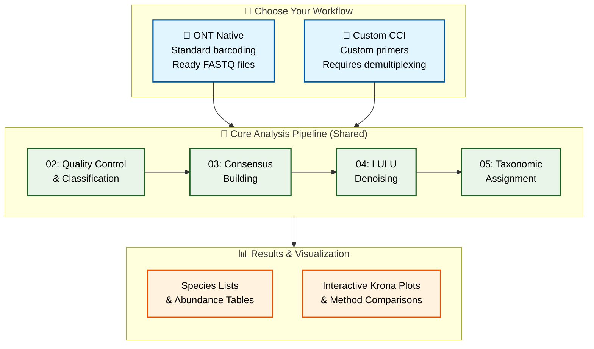

# DeCodeDNA

**Oxford Nanopore eDNA Metabarcoding Pipeline for Friday Harbor Lab Class 2025**

A complete, educational bioinformatics pipeline for analyzing environmental DNA (eDNA) using Oxford Nanopore long-read sequencing technology. Designed for Friday Harbor Labs' (FHL) eDNA summer course by [The eDNA Collaborative](https://www.ednacollab.org)

---

## 🧬 What is DeCodeDNA?

DeCodeDNA transforms raw Oxford Nanopore sequencing data into species identification and abundance estimates. From raw POD5 basecalling through consensus calling, LULU‐denoising and taxonomic assignment, you get OTU tables and visual plot results with educational insights at every step.

**Key Features:**
- 🚀 **Two complete workflows** for ONT Native and Custom CCI barcoding
- 🔬 **Dual clustering approaches** (fast vsearch + thorough, ONT-suited amplicon_sorter)  
- 🧹 **LULU denoising** with co-occurrence filtering
- 📊 **Method comparisons** (BLAST vs Kraken2, multiple databases)
- 🎓 **Educational focus** with timing estimates and explanations
- 📱 **Interactive visualizations** via Krona plots

---

## 🔄 Choose Your Workflow

DeCodeDNA supports **two distinct barcoding approaches**. Choose the one that matches your sequencing setup:

### 🔹 Workflow A: ONT Native Barcoding
**For samples using Oxford Nanopore's official barcoding kits**
- Uses ONT Native Barcoding Kits (NBD114.96, PBC096, etc.)
- Samples are already demultiplexed during basecalling
- **Best for**: Standard ONT workflows, beginners

```bash
# Quick start - ONT Native Workflow
cd workflows/ont_native_barcodes/
bash ../../scripts/02_quick_look_clean.sh . ../../results/ont_native_results/02_quicklook
# Continue with scripts 03, 04, 05...
```

### 🔹 Workflow B: Custom CCI Barcoding  
**For samples using custom primer-barcode combinations**
- Requires manual demultiplexing with ONTbarcoder2.3 GUI
- Includes quality filtering and EFPQ base conversion
- **Best for**: Custom primer designs, research applications

```bash
# Complete custom CCI workflow
cd workflows/custom_cci_barcodes/
# Step 1: Quality filter raw data
bash ../../scripts/00_quality_filter_predemux.sh 00_raw_data/test_fhl_customcci.fastq 01_filtered/quality_filtered.fastq

# Step 2: Manual demultiplexing (GUI)
# Use ONTbarcoder2.3 with 01_filtered/quality_filtered.fastq
# Output to: 02_demultiplexed/

# Step 3: Continue with core pipeline
bash ../../scripts/02_quick_look_clean.sh 02_demultiplexed/ ../../results/custom_cci_results/02_quicklook
# Continue with scripts 03, 04, 05...
```

**📖 Detailed workflow instructions:** See workflow-specific READMEs in each directory

---

## 🛠️ Installation

### Quick Setup (5-10 minutes)
```bash
# 1. Clone repository
git clone https://github.com/piedna/DeCodeDNA.git
cd DeCodeDNA

# 2. Create conda environment
conda env create -f environment.yml
conda activate decode-dna

# 3. Setup tools and databases
bash scripts/install_krona_taxonomy.sh
bash scripts/install_R_dependencies.sh
bash scripts/install_external_tools.sh

# 4. Setup databases (choose one)
# Option A: Use pre-built databases (classroom)
source scripts/setup_databases.sh

# Option B: Build databases from scratch (1-2 hours)
bash scripts/01_build_dbs_kraken_blastn.sh
```

**💡 Detailed installation guide:** [`installation_guide.md`](installation_guide.md)

---

## 🎓 For Students

### Which Workflow Should I Use?

**📋 Decision Tree:**
1. **Are you in the FHL course?** → Use ONT Native Workflow (ready-to-go data)
2. **Do you have raw ONT data from standard barcoding?** → Use ONT Native Workflow  
3. **Do you have custom primer-barcode combinations?** → Use Custom CCI Workflow
4. **Not sure?** → Start with ONT Native Workflow (easier)

### Common Commands

**ONT Native Workflow (Complete):**
```bash
cd workflows/ont_native_barcodes/
bash ../../scripts/02_quick_look_clean.sh . ../../results/ont_native_results/02_quicklook
bash ../../scripts/03_consensus_sort.sh ../../results/ont_native_results/02_quicklook ../../results/ont_native_results/03_consensus
bash ../../scripts/04_denoise.sh ../../results/ont_native_results/03_consensus ../../results/ont_native_results/04_denoise
bash ../../scripts/05_taxonomic_assignment.sh ../../results/ont_native_results/04_denoise ../../results/ont_native_results/05_taxonomy
```

**Custom CCI Workflow (After ONTbarcoder demux):**
```bash
cd workflows/custom_cci_barcodes/
bash ../../scripts/02_quick_look_clean.sh 02_demultiplexed/ ../../results/custom_cci_results/02_quicklook
bash ../../scripts/03_consensus_sort.sh ../../results/custom_cci_results/02_quicklook ../../results/custom_cci_results/03_consensus
bash ../../scripts/04_denoise.sh ../../results/custom_cci_results/03_consensus ../../results/custom_cci_results/04_denoise
bash ../../scripts/05_taxonomic_assignment.sh ../../results/custom_cci_results/04_denoise ../../results/custom_cci_results/05_taxonomy
```

---

## 🔬 Pipeline Overview



**Pipeline Scripts:**
- **Script 00:** Basecalling demo (optional)
- **Script 01:** Database building (one-time setup)
- **Scripts 02-05:** Core analysis pipeline (both workflows)

---

## 📊 Expected Results

### File Outputs
```
results/
├── [workflow]_results/
│   ├── 02_quicklook/               # Quality control & initial classification
│   ├── 03_consensus/               # Sequence clustering results
│   ├── 04_denoise/                 # Error-corrected sequences
│   └── 05_taxonomy/                # Final species identification
│       ├── 03_final_taxonomy/      # Species abundance tables ⭐
│       └── 04_krona_plots/         # Interactive visualizations ⭐
```

### Key Result Files
- **Species tables**: `*_classified_species.csv` - Final abundance matrices
- **Interactive plots**: `*_krona_plot.html` - Open in browser for exploration
- **Method comparison**: `Overall_Method_Comparison.csv` - BLAST vs Kraken2 performance

---

## ⚙️ Customization

**Environment Variables (set before running):**
```bash
# Quality & length filtering
export QUALITY_THRESHOLD=15        # Default: 12
export MIN_LENGTH=150              # Default: 100  
export MAX_LENGTH=350              # Default: 500

# Database selection  
export DATABASES="12s coi mitofish" # Default: all three

# Performance tuning
export THREADS=16                  # Default: 8
export SUBSET_COUNT=1000           # Default: 2000
```

**Example custom run:**
```bash
export QUALITY_THRESHOLD=18 MIN_LENGTH=200 MAX_LENGTH=300 DATABASES="mitofish"
bash scripts/02_quick_look_clean.sh workflows/ont_native_barcodes/ results/custom_analysis/02_quicklook
```

---

## 🎯 For Instructors

### Pre-Class Setup
1. **Test installation** on instructor machine
2. **Build databases** (1-2 hours): `bash scripts/01_build_dbs_kraken_blastn.sh`
3. **Prepare USB drives** with databases for classroom
4. **Choose student workflow** based on course objectives

### Student Guidance
- **Beginners**: Start with ONT Native Workflow
- **Advanced**: Try Custom CCI Workflow  
- **Comparison exercise**: Run both workflows on same data

### Class Day Commands
```bash
# Quick student setup
conda env create -f environment.yml
conda activate decode-dna
bash scripts/install_krona_taxonomy.sh
source scripts/setup_databases.sh

# Test with ONT Native
cd workflows/ont_native_barcodes/
bash ../../scripts/02_quick_look_clean.sh . ../../results/class_test/02_quicklook
```

---

## 🔧 Troubleshooting

### Common Issues

**"No demultiplexed files found"**
- Check workflow directory structure
- Ensure you're in the correct workflow folder
- Verify ONTbarcoder output is in `02_demultiplexed/`

**"Database not found"**
- Run: `source scripts/setup_databases.sh`
- Check USB drive connection
- Build local databases: `bash scripts/01_build_dbs_kraken_blastn.sh`

**"conda: command not found"**
- Install miniconda first
- Restart terminal after installation
- See [`installation_guide.md`](installation_guide.md) for details

### Workflow-Specific Help
- **ONT Native issues**: See `workflows/ont_native_barcodes/README_ont_native.md`
- **Custom CCI issues**: See `workflows/custom_cci_barcodes/README_custom_cci.md`

---

## 📞 Support & Citation

### Getting Help
- **Installation issues**: [`installation_guide.md`](installation_guide.md)
- **Workflow questions**: Check workflow-specific READMEs
- **Course support**: `ednacollab@uw.edu`
- **Bug reports**: [GitHub Issues](https://github.com/piedna/DeCodeDNA/issues)

### Citation
```bibtex
@software{decodedna2025,
  title={DeCodeDNA: Oxford Nanopore eDNA Metabarcoding Pipeline},
  author={Ip, Y.C.A. and The eDNA Collaborative},
  year={2025},
  url={https://github.com/piedna/DeCodeDNA}
}
```

---

**Developed for Friday Harbor Labs eDNA Course 2025**  
*Making eDNA analysis accessible through dual workflow design*