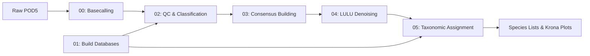

# DeCodeDNA

**Oxford Nanopore eDNA Metabarcoding Pipeline for FHL Class 2025**

A complete, educational bioinformatics pipeline for analyzing environmental DNA (eDNA) using Oxford Nanopore long-read sequencing technology. Designed for Friday Harbor Labs' eDNA course by the eDNA Collaborative.

---

## 🧬 What is DeCodeDNA?

DeCodeDNA transforms raw Oxford Nanopore sequencing data into species identification and abundance estimates. From raw POD5 basecalling through consensus calling, LULU‐denoising and taxonomic assignment, you get publication-ready results with educational insights at every step.

**Key Features:**
- 🚀 **Smart basecalling** adapted to local machine specs
- 🔬 **Dual clustering approaches** (fast vsearch + thorough amplicon_sorter)  
- 🧹 **LULU denoising** with co-occurrence filtering
- 📊 **Method comparisons** (BLAST vs Kraken2, multiple databases)
- 🎓 **Educational focus** with timing estimates and explanations
- 📱 **Interactive visualizations** via Krona plots

---

## 🚀 Quick Start

### 1. Install
```bash
# Clone and setup (5 minutes)
git clone https://github.com/piedna/DeCodeDNA.git
cd DeCodeDNA && chmod +x scripts/*.sh
conda env create -f environment.yml
conda activate decode-dna
```

### 2. Test with Mock Data
```bash
# Run complete pipeline (15 minutes)
bash scripts/02_quick_look_clean.sh mock/ results/02_quicklook
bash scripts/03_consensus_sort.sh results/02_quicklook results/03_consensus  
bash scripts/04_denoise.sh results/03_consensus results/04_denoise
bash scripts/05_taxonomic_assignment.sh results/04_denoise results/05_taxonomy
```

### 3. View Results
Open `results/05_taxonomy/04_krona_plots/*.html` in your browser!

📖 **Need detailed setup?** → See [`installation_guide.md`](installation_guide.md)

---

## 🔄 Pipeline Overview



**Educational Comparisons Built-In:**
- **Clustering:** vsearch (fast) vs amplicon_sorter (thorough)
- **Classification:** BLAST (similarity) vs Kraken2 (k-mer)
- **Databases:** 12S vs COI vs MitoFish
- **Visualization:** Multiple interactive Krona plots

---

## 📊 What You Get

### Input → Output
- **Raw POD5 files** → **Species abundance tables**
- **Quality-filtered sequences** → **Interactive taxonomic plots**
- **Multiple clustering methods** → **Method comparison statistics**

### Key Result Files
- `results/05_taxonomy/03_final_taxonomy/*_classified_species.csv` - Species abundance matrices
- `results/05_taxonomy/04_krona_plots/*.html` - Interactive taxonomic visualizations
- `results/05_taxonomy/03_final_taxonomy/method_comparison_summary.csv` - BLAST vs Kraken2 performance

---

## 🎓 Educational Features

### 📁 Mock Data Included
Ready-to-use 12S fish community dataset with 200K reads per sample:
```
mock/
├── test_fhl_200k_1.fastq     # Sample replicate 1
├── test_fhl_200k_2.fastq     # Sample replicate 2  
├── test_fhl_200k_3.fastq     # Sample replicate 3
└── mock_amplicon_sorter_*.fasta  # Pre-computed server results
```

### ⏱️ Realistic Timing
- **Complete setup:** 30-45 minutes (one-time)
- **Pipeline execution:** 15-25 minutes on mock data
- **Individual steps:** 3-10 minutes each

### 🔬 Method Comparisons
- **Performance:** GPU vs CPU basecalling
- **Accuracy:** Multiple taxonomic databases
- **Speed:** Local vs server-optimized processing

---

## 💻 Usage

### Classroom Workflow
```bash
conda activate decode-dna
bash scripts/02_quick_look_clean.sh mock/ results/02_quicklook
bash scripts/03_consensus_sort.sh results/02_quicklook results/03_consensus  
bash scripts/04_denoise.sh results/03_consensus results/04_denoise
bash scripts/05_taxonomic_assignment.sh results/04_denoise results/05_taxonomy
```

### Real Data Workflow
```bash
# 1. Build databases (one-time)
./scripts/01_build_dbs_kraken_blastn.sh

# 2. Process your data
bash scripts/02_quick_look_clean.sh your_fastq_dir/ results/02_quicklook
# ... continue with steps 3-5
```

### Customization
```bash
# Faster for teaching
export SUBSET_COUNT=1000
export THREADS=4

# Different quality thresholds
export QUALITY_THRESHOLD=15
export MIN_LENGTH=200
```

---

## 📚 Documentation

- 📖 **[Installation Guide](installation_guide.md)** - Detailed setup instructions
- 🔬 **[Scientific Background](docs/scientific_background.md)** - Pipeline methodology
- 🎓 **[Teaching Notes](docs/teaching_notes.md)** - Classroom guidance
- 🔧 **[Troubleshooting](docs/troubleshooting.md)** - Common issues and solutions

---

## 🛠️ Requirements

- **OS:** macOS or Linux
- **RAM:** 8GB minimum, 16GB+ recommended
- **Storage:** 10GB+ free space
- **Dependencies:** Managed via conda (see `environment.yml`)

---

## 📄 Citation

```bibtex
@software{decodedna2025,
  title={DeCodeDNA: Oxford Nanopore eDNA Metabarcoding Pipeline},
  author={Ip, Y.C.A. and The eDNA Collaborative},
  year={2025},
  url={https://github.com/piedna/DeCodeDNA}
}
```

---

## 📞 Support

- 📖 **Installation help:** [`installation_guide.md`](installation_guide.md)
- 🐛 **Issues:** [GitHub Issues](https://github.com/piedna/DeCodeDNA/issues)
- 📧 **Course questions:** `ednacollab@uw.edu`

---

**Developed for Friday Harbor Labs eDNA Course 2025**  
*Making eDNA analysis accessible, educational, and reproducible*