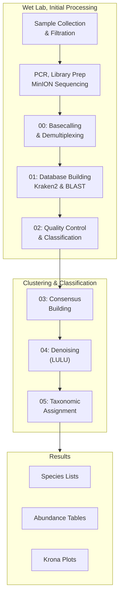

# DeCodeDNA

**Oxford Nanopore eDNA Metabarcoding Pipeline for FHL Class 2025**

A complete, educational bioinformatics pipeline for analyzing environmental DNA (eDNA) using Oxford Nanopore long-read sequencing technology. Designed for Friday Harbor Labs' eDNA course conducted by the eDNA Collaborative.

---

## 🧬 What is DeCodeDNA?

DeCodeDNA is a turnkey Nanopore metabarcoding pipeline that transforms raw Oxford Nanopore sequencing data into species identification and abundance estimates. From raw POD5 basecalling all the way through consensus calling, LULU‐denoising and taxonomic assignment, you get:

- **Smart basecalling workflows** adapted to local machine specifications via Dorado  
- **Rapid classification and cleanup** using Kraken2 with interactive Krona visualizations
- **Consensus building** with both fast (vsearch) and thorough (amplicon_sorter) approaches
- **Artifact removal** using the LULU R package with co-occurrence filtering
- **Comprehensive taxonomic assignment** with BLAST and Kraken2 comparison

It handles multiplexed COI or 12S amplicons, works on any modern laptop or server, and ships with complete mock community data for hands-on learning.

---

## 🚀 Quick Start

### 1. Clone the repo & setup workspace
```bash
mkdir ~/eDNA_workshop && cd ~/eDNA_workshop
git clone https://github.com/piedna/DeCodeDNA.git
cd DeCodeDNA
```

### 2. Make scripts executable & create environment
```bash
chmod +x scripts/*.sh
conda env create -f environment.yml
conda activate decode-dna
```

### 3. Install R package for denoising
```bash
Rscript -e 'if(!require(devtools)) install.packages("devtools"); devtools::install_github("tobiasgf/lulu")'
```

### 4. Test with mock data (15 minutes)
```bash
bash scripts/02_quick_look_clean.sh mock/basecalled_fastq/ results/02_quicklook
bash scripts/03_consensus_sort.sh results/02_quicklook results/03_consensus  
bash scripts/04_denoise.sh results/03_consensus results/04_denoise
bash scripts/05_taxonomic_assignment.sh results/04_denoise results/05_taxonomy
```

**🎉 Check results in `results/05_taxonomy/04_krona_plots/*.html`!**

---

## 📋 Dependencies

| Tool            | Purpose                                   |
|-----------------|-------------------------------------------|
| **Dorado**      | SUP basecalling for Oxford Nanopore data |
| **Cutadapt**    | Primer trimming and adapter removal      |
| **NanoFilt**    | Quality & length filtering                |
| **SeqKit**      | FASTA/Q utilities and statistics         |
| **Kraken2**     | Rapid taxonomic classification            |
| **VSEARCH**     | Fast clustering & sequence comparison     |
| **CD-HIT**      | Alternative sequence clustering           |
| **BLAST**       | Sequence alignment & taxonomic assignment|
| **TaxonKit**    | Taxonomy database utilities              |
| **Krona**       | Interactive HTML taxonomic visualizations|
| **Amplicon_sorter** | Advanced consensus sequence calling   |
| **LULU (R)**    | Post-clustering error correction          |
| **ONTbarcoder** | Demultiplex custom CCI barcodes          |
| **MinKNOW**     | Sequencer control & live basecalling     |

### Automated Installation
```bash
conda env create -f environment.yml
conda activate decode-dna
```

*External tools (Dorado, amplicon_sorter, ONTbarcoder) require manual installation - see `installation_guide.md` for details.*

---

## 🔄 Pipeline Workflow Overview



---

## 📖 Pipeline Steps

### Step 00: Basecalling and Demultiplexing
- **Input**: Raw MinION sequencing data (POD5 files)
- **Process 1**: SUP (Super Accurate) basecalling using Dorado  
  *https://github.com/nanoporetech/dorado*
- **Process 2**: Demultiplex custom CCI barcodes with ONTbarcoder2.3  
  *https://github.com/asrivathsan/ONTbarcoder/releases*
- **Output**: High-quality FASTQ sequences organized by sample
- **Teaching note**: Scripts handle both GPU and CPU basecalling for different systems

### Step 01: Reference Database Building
- **Input**: Curated FASTA sequences from multiple sources
- **Process**: Download and build local reference databases for taxonomic classification
- **Databases created**:
  - **MIDORI 12S**: Curated 12S rRNA sequences for fish identification
  - **MIDORI COI**: Cytochrome oxidase I sequences for broader metazoan diversity
  - **MitoFish**: Complete fish mitogenome database for comprehensive coverage
- **Output formats**:
  - **Kraken2 databases**: K-mer based classification (fast, probabilistic)
  - **BLAST databases**: Sequence similarity search (slower, precise alignments)
- **Why both approaches?**
  - **Kraken2**: Rapid initial classification, handles short/degraded sequences well, provides confidence scores
  - **BLAST**: High-precision alignments, better for novel sequences, allows manual curation of hits
  - **Complementary strengths**: Kraken2 for speed and broad coverage, BLAST for accuracy and verification
  - **Cross-validation**: Compare results between methods to increase confidence in identifications

### Step 02: Quality Control & Initial Classification  
- **Input**: Basecalled and demultiplexed FASTQ files
- **Process**: Quality filtering (Q≥12, 100-500bp) + initial Kraken2 classification
- **Target control**: Remove off-target sequences, retain fish-classified reads
- **Output**: Filtered sequences + preliminary species identification
- **Visualization**: Length distribution plots + classification rate summaries

### Step 03: Consensus Building & Clustering
- **Input**: Quality-filtered, fish-classified sequences  
- **Process**: Two complementary approaches for educational comparison
  - **vsearch**: Fast local clustering (97% similarity, runs immediately)
  - **amplicon_sorter**: Advanced clustering (server-optimized, pre-computed results provided)
- **Tools**: vsearch, amplicon_sorter, seqkit
- **Output**: Representative consensus sequences (ASVs) from both methods

### Step 04: Denoising & Error Correction
- **Input**: Consensus sequences (ASVs) from clustering
- **Process**: Remove sequencing artifacts using LULU algorithm
- **Method**: 
  - Self-BLAST alignment of all sequences
  - Co-occurrence analysis across sample replicates  
  - Parent-daughter relationship detection
  - Removal of likely PCR/sequencing errors
- **Output**: Clean, high-confidence sequence clusters (OTUs)

### Step 05: Taxonomic Assignment & Visualization
- **Input**: Denoised sequence clusters (OTUs)
- **Process**: Comprehensive taxonomic classification using multiple approaches
- **Methods**: 
  - **BLAST**: Sequence similarity search against curated databases (12S, COI, MitoFish)
  - **Kraken2**: K-mer based classification with confidence scoring
  - **Database comparison**: Cross-validation between methods for robust identification
- **Output**: 
  - Final species identification matrices
  - Abundance tables per sample
  - Interactive Krona plots for visualization
  - Method comparison statistics

---

## 🎓 Educational Features

### 📁 Mock Data Included
The `mock/` directory contains a complete 12S fish community dataset:

```
mock/
├── basecalled_fastq/              # Ready-to-use sequences (START HERE)
│   ├── test_fhl_200k_1.fastq     # Sample replicate 1 (~200k reads)
│   ├── test_fhl_200k_2.fastq     # Sample replicate 2  
│   └── test_fhl_200k_3.fastq     # Sample replicate 3
├── pod5_barcode50/               # Modern POD5 files (for basecalling demo)
├── fast5/                        # Legacy format (educational reference)
└── mock_amplicon_sorter_*.fasta  # Pre-computed server results
```

### 🔬 Method Comparisons Built-In
- **Clustering**: vsearch (fast) vs amplicon_sorter (thorough)
- **Classification**: BLAST (similarity) vs Kraken2 (k-mer)  
- **Visualization**: Multiple interactive Krona plots
- **Performance**: GPU vs CPU basecalling timing

### ⏱️ Realistic Timing Estimates
- **Complete setup**: 30-45 minutes (one-time)
- **Pipeline execution**: 15-25 minutes on mock data
- **Individual steps**: 3-10 minutes each for focused learning

---

## 💻 System Requirements

- **Operating System**: macOS (Intel/Apple Silicon) or Linux
- **RAM**: 8GB minimum, 16GB+ recommended for large datasets
- **Storage**: 10GB+ free space for databases and results
- **CPU**: 4+ cores recommended (pipeline scales with available cores)
- **Network**: Stable internet for database downloads (~2GB one-time)

---

## 🛠️ Installation

### Quick Setup (Students)
```bash
# Complete minimal setup in 5 minutes
mkdir ~/eDNA_workshop && cd ~/eDNA_workshop
git clone https://github.com/piedna/DeCodeDNA.git && cd DeCodeDNA
chmod +x scripts/*.sh
conda env create -f environment.yml
conda activate decode-dna
Rscript -e 'devtools::install_github("tobiasgf/lulu")'
```

### Complete Setup (Instructors)
For full pipeline including basecalling and database building, see detailed instructions in `installation_guide.md`.

---

## 🔬 Usage

### Classroom Workflow (Mock Data)
```bash
# Activate environment
conda activate decode-dna

# Run complete pipeline (15 minutes)
bash scripts/02_quick_look_clean.sh mock/basecalled_fastq/ results/02_quicklook
bash scripts/03_consensus_sort.sh results/02_quicklook results/03_consensus  
bash scripts/04_denoise.sh results/03_consensus results/04_denoise
bash scripts/05_taxonomic_assignment.sh results/04_denoise results/05_taxonomy
```

### Real Data Workflow
```bash
# 1. Build databases (one-time, 20-30 minutes)
./scripts/01_build_dbs_kraken_blastn.sh

# 2. Basecalling (if starting from POD5 files)  
bash scripts/00_basecall_and_demux.sh

# 3. Continue with steps 2-5 using your FASTQ directory
bash scripts/02_quick_look_clean.sh your_fastq_dir/ results/02_quicklook
bash scripts/03_consensus_sort.sh results/02_quicklook results/03_consensus  
bash scripts/04_denoise.sh results/03_consensus results/04_denoise
bash scripts/05_taxonomic_assignment.sh results/04_denoise results/05_taxonomy
```

### Customization Options
```bash
# Faster processing for teaching
export SUBSET_COUNT=1000
export THREADS=4

# Different quality thresholds  
export QUALITY_THRESHOLD=15
export MIN_LENGTH=200

# Force local amplicon_sorter execution (may hang)
RUN_AMPLICON_SORTER=1 bash scripts/03_consensus_sort.sh ...
```

---

## 📊 Output Structure

```
results/
├── 02_quicklook/           # Quality control & initial classification
│   ├── filtered/           # Quality-filtered sequences
│   └── mitofish/          # Fish-classified sequences + Krona plots
├── 03_consensus/           # Sequence clustering results  
│   ├── vsearch_clustering/ # Fast local clustering
│   └── amplicon_sorter_consensus.fasta  # High-quality consensus
├── 04_denoise/            # Error-corrected sequences
│   ├── otu_table_lulu_curated.csv      # Final OTU abundance table
│   └── otu_representatives_combined.fasta  # Representative sequences  
└── 05_taxonomy/           # Final species identification
    ├── 01_blast_results/   # BLAST taxonomic assignments
    ├── 02_kraken2_results/ # Kraken2 classifications
    ├── 03_final_taxonomy/  # Species abundance matrices
    └── 04_krona_plots/     # Interactive HTML visualizations ⭐
```

### Key Result Files
- **Species tables**: `results/05_taxonomy/03_final_taxonomy/*_classified_species.csv`
- **Interactive plots**: `results/05_taxonomy/04_krona_plots/*.html` 
- **Method comparison**: `results/05_taxonomy/03_final_taxonomy/method_comparison_summary.csv`

---

## 🧪 Troubleshooting

### Common Issues
- **"Command not found"**: Ensure `conda activate decode-dna` is run first
- **"Permission denied"**: Run `chmod +x scripts/*.sh` after cloning
- **"Database not found"**: Build databases with `./scripts/01_build_dbs_kraken_blastn.sh`
- **"pod5 illegal instruction"**: Expected on ARM64 Macs, handled gracefully

### Performance Tips
- Use `SUBSET_COUNT=1000` for faster classroom demonstrations
- Monitor system resources with `top` during large dataset processing
- Clean temporary files with `rm -rf results/*/00_temp_files/`

---

## 📚 Scientific Background

### Key Publications
- **Kraken2**: Wood & Salzberg (2014) - Improved metagenomic analysis  
- **LULU**: Frøslev et al. (2017) - Post-clustering curation algorithm
- **BLAST**: Altschul et al. (1990) - Basic local alignment search tool
- **amplicon_sorter**: Vierstraete et al. (2021) - ONT amplicon processing

### Pipeline Philosophy
- **Educational transparency**: All parameters documented and adjustable
- **Method comparison**: Multiple approaches for validation and learning
- **Quality focus**: Rigorous filtering and error correction throughout
- **Reproducibility**: Version-controlled environments and clear workflows

---

## 💡 Citation

If you use DeCodeDNA in your research:

```bibtex
@software{decodedna2025,
  title={DeCodeDNA: Oxford Nanopore eDNA Metabarcoding Pipeline},
  author={Friday Harbor Labs eDNA Collaborative},
  year={2025},
  url={https://github.com/piedna/DeCodeDNA},
  note={Educational bioinformatics pipeline for environmental DNA analysis}
}
```

---

## 📄 License

This project is licensed under the MIT License - see the LICENSE file for details.

## 📞 Support

For questions or issues:
- **Check the `installation_guide.md`** for detailed setup instructions
- **Review script comments** for step-specific guidance  
- **Contact course instructors**: `ednacollab@uw.edu`

---

**Developed for Friday Harbor Labs eDNA Course 2025**  
*Making eDNA analysis accessible, educational, and reproducible*