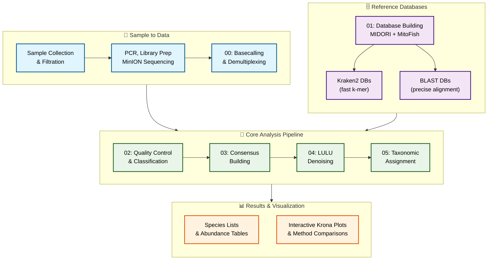

# DeCodeDNA

**Oxford Nanopore eDNA Metabarcoding Pipeline for FHL Class 2025**

A complete, educational bioinformatics pipeline for analyzing environmental DNA (eDNA) using Oxford Nanopore long-read sequencing technology. Designed for Friday Harbor Labs' eDNA course by the eDNA Collaborative.

---

## 🧬 What is DeCodeDNA?

DeCodeDNA transforms raw Oxford Nanopore sequencing data into species identification and abundance estimates. From raw POD5 basecalling through consensus calling, LULU‐denoising and taxonomic assignment, you get publication-ready results with educational insights at every step.

**Key Features:**
- 🚀 **Smart basecalling** adapted to local machine specs
- 🔬 **Dual clustering approaches** (fast vsearch + thorough amplicon_sorter)  
- 🧹 **LULU denoising** with co-occurrence filtering
- 📊 **Method comparisons** (BLAST vs Kraken2, multiple databases)
- 🎓 **Educational focus** with timing estimates and explanations
- 📱 **Interactive visualizations** via Krona plots

---

## 🔄 Pipeline Workflow Overview



**Educational Comparisons Built-In:**
- **Clustering:** vsearch (fast) vs amplicon_sorter (thorough)
- **Classification:** BLAST (similarity) vs Kraken2 (k-mer)
- **Databases:** 12S vs COI vs MitoFish
- **Visualization:** Multiple interactive Krona plots

---

## 📋 Dependencies

All dependencies are automatically managed via conda. Here's what each tool does:

| Tool            | Purpose                                   |
|-----------------|-------------------------------------------|
| **Dorado**      | SUP basecalling for Oxford Nanopore data |
| **Cutadapt**    | Primer trimming and adapter removal      |
| **NanoFilt**    | Quality & length filtering                |
| **SeqKit**      | FASTA/Q utilities and statistics         |
| **Kraken2**     | Rapid taxonomic classification            |
| **VSEARCH**     | Fast clustering & sequence comparison     |
| **CD-HIT**      | Alternative sequence clustering           |
| **BLAST**       | Sequence alignment & taxonomic assignment|
| **TaxonKit**    | Taxonomy database utilities              |
| **Krona**       | Interactive HTML taxonomic visualizations|
| **Amplicon_sorter** | Advanced consensus sequence calling   |
| **LULU (R)**    | Post-clustering error correction          |
| **ONTbarcoder** | Demultiplex custom CCI barcodes          |
| **MinKNOW**     | Sequencer control & live basecalling     |

---

## 🚀 Quick Start

### 1. Install Dependencies
```bash
# Clone and setup (5 minutes)
git clone https://github.com/piedna/DeCodeDNA.git
cd DeCodeDNA && chmod +x scripts/*.sh
conda env create -f environment.yml
conda activate decode-dna
```

### 2. Setup Databases
**Recommended approach: Build local databases with USB backup**

```bash
# 🔨 Build local databases (1.5 hours, but you own them forever)
bash scripts/01_build_dbs_kraken_blastn.sh

# 🔍 Auto-detect will prefer local, fallback to USB
source scripts/setup_databases.sh
```

**Alternative quick setups:**
- **🏫 FHL Course Students:** USB drives available → See [Classroom Setup](#classroom-setup)
- **⚡ Quick Demo:** `source scripts/setup_databases.sh` (auto-detects USB if no local DBs)

### 3. Run Complete Pipeline
```bash
# Works for mock data or your own FASTQ files (15-25 minutes)
bash scripts/02_quick_look_clean.sh mock/ results/02_quicklook
bash scripts/03_consensus_sort.sh results/02_quicklook results/03_consensus  
bash scripts/04_denoise.sh results/03_consensus results/04_denoise
bash scripts/05_taxonomic_assignment.sh results/04_denoise results/05_taxonomy

# View results: Open results/05_taxonomy/04_krona_plots/*.html in browser
```

📖 **Need detailed setup?** → See [`installation_guide.md`](installation_guide.md)

---

## 🏫 Classroom Setup (Pre-built Databases)

**For FHL course students only** - pre-built databases (158GB) are provided on USB drives:

**Database Versions (Built: July 18, 2025):**
- MIDORI 12S: GenBank265_2025-03-08 release
- MIDORI COI: GenBank265_2025-03-08 release  
- MitoFish: Complete & partial mitogenomes (July 2025)
- Total size: 158GB (Kraken2 + BLAST databases)

### Quick Setup Options:

**Option A: Auto-Detection (Recommended)**
```bash
# Automatically detect USB or local databases
source scripts/setup_databases.sh

# Verify databases are accessible
echo "DB_ROOT: $DB_ROOT"
echo "BLAST_DB_ROOT: $BLAST_DB_ROOT"
ls -la "$DB_ROOT"
ls -la "$BLAST_DB_ROOT"

# Then run the pipeline normally (see Quick Start Step 3 above)
```

**Option B: Manual USB Setup**
```bash
# Point to USB databases (if auto-detection fails)
export DB_ROOT="/Volumes/DeCodeDNA_DB/databases/kraken2_db"
export BLAST_DB_ROOT="/Volumes/DeCodeDNA_DB/databases/blast_db"

# Verify databases found
ls $DB_ROOT && ls $BLAST_DB_ROOT
```

**Option C: Copy to Local Drive (Fast but needs 160GB space)**
```bash
# Copy from USB to local drive (faster analysis)
cp -r /Volumes/DeCodeDNA_DB/databases ../

# No exports needed - use pipeline normally
```

### Future Database Updates
```bash
# Update databases on USB drive (preserves for future classes)
export DB_ROOT="/Volumes/DeCodeDNA_DB/databases/kraken2_db"
export BLAST_DB_ROOT="/Volumes/DeCodeDNA_DB/databases/blast_db"

# Run database builder to update USB
bash scripts/01_build_dbs_kraken_blastn.sh
```

> **💡 Tip:** The USB drive doubles as storage for your updated databases after the course!

---

## 📜 Pipeline Scripts

The pipeline consists of 6 main scripts that can be run sequentially or independently:

### Script 00: Basecalling Demo
**`00_basecall_and_demux.sh`** - Oxford Nanopore basecalling demonstration
- **Purpose:** Educational showcase of basecalling process
- **What it does:** Downloads models, converts FAST5→POD5, demonstrates GPU vs CPU basecalling
- **When to use:** Optional demo for understanding ONT basecalling workflow
- **Output:** Basecalled FASTQ files for comparison

### Script 01: Database Builder  
**`01_build_dbs_kraken_blastn.sh`** - Reference database construction
- **Purpose:** One-time setup to build all reference databases
- **What it does:** Downloads MIDORI and MitoFish sequences, builds BLAST and Kraken2 databases
- **When to use:** Once before running taxonomic assignment (Script 05)
- **Output:** Ready-to-use databases in `../databases/`
- **Timing:** ~1.5 hours (one-time setup)

### Script 02: Quality Control & Classification
**`02_quick_look_clean.sh`** - Initial processing and quality filtering
- **Purpose:** Clean sequences and get first taxonomic overview
- **What it does:** Quality filtering, length filtering, initial Kraken2 classification
- **Input:** Raw FASTQ files (from basecalling or mock data)
- **Output:** Filtered sequences, classification reports, length distributions
- **Timing:** ~3-5 minutes

### Script 03: Consensus Building
**`03_consensus_sort.sh`** - Dual clustering approach demonstration
- **Purpose:** Compare two clustering methods for consensus generation
- **What it does:** 
  - **vsearch:** Fast local clustering (runs automatically)
  - **amplicon_sorter:** Advanced clustering (demo command provided)
- **Input:** Classified sequences from Script 02
- **Output:** Consensus sequences from both methods
- **Timing:** ~5-8 minutes

### Script 04: LULU Denoising
**`04_denoise.sh`** - Error correction and artifact removal
- **Purpose:** Remove sequencing errors and PCR artifacts using LULU algorithm
- **What it does:** Self-BLAST alignment, co-occurrence analysis, OTU curation
- **Input:** Consensus sequences from Script 03  
- **Output:** Curated OTU tables, cleaned representative sequences
- **Timing:** ~3-7 minutes

### Script 05: Taxonomic Assignment
**`05_taxonomic_assignment.sh`** - Final species identification and visualization
- **Purpose:** Comprehensive taxonomic assignment with method comparison
- **What it does:**
  - **BLAST:** Similarity-based assignment against multiple databases
  - **Kraken2:** K-mer based classification  
  - **Krona plots:** Interactive taxonomic visualizations
- **Input:** Denoised sequences from Script 04
- **Output:** Species abundance tables, comparison matrices, Krona plots
- **Timing:** ~5-10 minutes

**Total Pipeline Time:** 15-25 minutes for mock data

---

## 📊 Output Structure

Understanding what the pipeline produces helps you navigate and interpret results:

```
results/
├── 02_quicklook/                    # Quality control & initial classification
│   ├── filtered/                    # Quality-filtered sequences
│   │   ├── *_filtered.fastq        # Sequences passing Q≥12, length filters
│   │   └── *_length_dist/           # Length distribution plots
│   └── mitofish/                    # Fish-classified sequences + Krona plots
│       ├── *_mitofish.report.txt    # Kraken2 classification report
│       ├── *_classified.fasta       # Fish-identified sequences
│       └── *.krona.html             # Interactive taxonomic plots
├── 03_consensus/                    # Sequence clustering results  
│   ├── vsearch_clustering/          # Fast local clustering
│   │   └── mitofish/               # Database-specific results
│   │       └── *_vsearch_consensus.fasta  # Representative sequences
│   └── amplicon_sorter_consensus.fasta    # High-quality consensus (pre-computed)
├── 04_denoise/                     # Error-corrected sequences
│   └── mitofish/                   # Database-specific denoised results
│       ├── otu_table_*_lulu_curated.csv       # Final OTU abundance tables
│       ├── otu_representatives_*.fasta        # Representative sequences
│       └── otu_self_blast_*.out              # Self-alignment results
└── 05_taxonomy/                    # Final species identification
    ├── 01_blast_results/            # BLAST taxonomic assignments
    │   └── *_blast_hits.tsv         # Best BLAST matches per method
    ├── 02_kraken2_results/          # Kraken2 classifications  
    │   ├── *_kraken2_output.txt     # Classification details
    │   └── *_kraken2_report.txt     # Summary reports
    ├── 03_final_taxonomy/           # Species abundance matrices
    │   ├── BLAST_vsearch_*GENE*_classified_species.csv   # Final OTU tables ⭐
    │   └── Overall_Method_Comparison.csv  # Performance summary
    └── 04_krona_plots/              # Interactive HTML visualizations ⭐
        └── *_krona_plot.html        # Method-specific taxonomic plots
```

### Key Result Files
- **Species comparison tables**: `BLAST_vsearch_*GENE*_classified_species.csv` - Final OTU tables
- **Interactive plots**: `04_krona_plots/*.html` - Open these in your browser!
- **Method performance**: `Overall_Method_Comparison.csv` - BLAST vs Kraken2 stats

---

## 🎓 Educational Features

### 📁 Mock Data Included
Ready-to-use 12S fish community dataset with 200K reads per sample:
```
mock/
├── fast5/                          # Legacy FAST5 files (educational)
├── pod5_barcode50/                 # Modern POD5 files (for basecalling demo)
├── test_fhl_200k_1.fastq          # Sample replicate 1 (~200k reads)
├── test_fhl_200k_2.fastq          # Sample replicate 2  
├── test_fhl_200k_3.fastq          # Sample replicate 3
└── mock_amplicon_sorter_clustered_consensus_*.fasta  # Pre-computed server results
```

### 🔬 Method Comparisons
- **Performance:** GPU vs CPU basecalling
- **Accuracy:** Multiple taxonomic databases
- **Speed:** Local vs server-optimized processing

---

## 💻 Advanced Usage

### Pipeline Customization (No Script Editing Required!)

**The pipeline is fully customizable without editing any scripts.** Just set environment variables before running:

#### Quick Setup for Different Data Types

```bash
# For 2000bp mitochondrial data:
export QUALITY_THRESHOLD=18 MIN_LENGTH=1500 MAX_LENGTH=3000 DATABASES="mitofish" THREADS=16

# For standard eDNA samples:
export QUALITY_THRESHOLD=15 MIN_LENGTH=150 MAX_LENGTH=350 DATABASES="12s coi mitofish" THREADS=8

# For fast teaching demos:
export DATABASES="mitofish" THREADS=4 SUBSET_COUNT=500
```

#### All Available Options

| Parameter | What it does | Default | Example |
|-----------|--------------|---------|---------|
| `QUALITY_THRESHOLD` | Minimum quality score | 12 | 18 |
| `MIN_LENGTH` | Minimum sequence length | 100 | 1500 |
| `MAX_LENGTH` | Maximum sequence length | 500 | 3000 |
| `DATABASES` | Which databases to use | "12s coi mitofish" | "mitofish" |
| `THREADS` | CPU cores to use | 8 | 16 |
| `SUBSET_COUNT` | Max sequences for taxonomy | 2000 | 1000 |

#### How to Use Custom Parameters

```bash
# 1. Set your parameters once
export QUALITY_THRESHOLD=18 MIN_LENGTH=1500 MAX_LENGTH=3000 DATABASES="mitofish" THREADS=16

# 2. Check they're set
echo "Quality: $QUALITY_THRESHOLD, Length: $MIN_LENGTH-$MAX_LENGTH, DB: $DATABASES, Threads: $THREADS"

# 3. Run pipeline normally - no script editing needed!
bash scripts/02_quick_look_clean.sh mock/ results/02_quicklook
bash scripts/03_consensus_sort.sh results/02_quicklook results/03_consensus
bash scripts/04_denoise.sh results/03_consensus results/04_denoise
bash scripts/05_taxonomic_assignment.sh results/04_denoise results/05_taxonomy

# 4. Advanced: Enable amplicon_sorter local execution (may hang on local machines)
RUN_AMPLICON_SORTER=1 bash scripts/03_consensus_sort.sh results/02_quicklook results/03_consensus
```

**That's it!** The scripts automatically use your custom parameters.

### Real Data Workflow

**Complete Pipeline Flow:**
```
Raw POD5 → Dorado → ONTbarcoder2.3 → EFPQ_convert → DeCodeDNA Pipeline
```

**Step-by-step for your own data:**

```bash
# 1. Basecalling (GPU recommended, might be done on server/gaming laptop)
bash scripts/00_basecall_and_demux.sh

# 2. Demultiplexing with ONTbarcoder2.3 (GUI application)
# Create demultiplex sheet with 5 columns:
# sample_name,forward_tag,reverse_tag,forward_primer,reverse_primer
# 
# Example entries:
# 1_mifish_sample_a,CCATTGTATAAACC,CCATTGTATAAACC,GCCGGTAAAACTCGTGCCAGC,CATAGTGGGGTATCTAATCCCAGTTTG
# 2_mifish_sample_b,CCGTATAGAGTACC,CCGTATAGAGTACC,GCCGGTAAAACTCGTGCCAGC,CATAGTGGGGTATCTAATCCCAGTTTG

# 3. Fix ONTbarcoder output format (if needed)
bash scripts/EFPQ_ontbarcoder_convert.sh

# 4. Process your demultiplexed data (same as Quick Start Step 3)
bash scripts/02_quick_look_clean.sh your_fastq_dir/ results/02_quicklook
bash scripts/03_consensus_sort.sh results/02_quicklook results/03_consensus
bash scripts/04_denoise.sh results/03_consensus results/04_denoise
bash scripts/05_taxonomic_assignment.sh results/04_denoise results/05_taxonomy
```

📖 **ONTbarcoder2.3 detailed usage:** https://github.com/asrivathsan/ONTbarcoder/releases

### Complete Workflow Examples

#### Standard Classroom Workflow
```bash
# Always start by activating environment
conda activate decode-dna

# Setup databases (local first, USB fallback)
source scripts/setup_databases.sh

# Set parameters for typical eDNA samples
export QUALITY_THRESHOLD=15 MIN_LENGTH=150 MAX_LENGTH=350 DATABASES="12s coi mitofish" THREADS=8

# Run complete pipeline
bash scripts/02_quick_look_clean.sh mock/ results/02_quicklook
bash scripts/03_consensus_sort.sh results/02_quicklook results/03_consensus  
bash scripts/04_denoise.sh results/03_consensus results/04_denoise
bash scripts/05_taxonomic_assignment.sh results/04_denoise results/05_taxonomy

# View results: Open results/05_taxonomy/04_krona_plots/*.html in browser
```

#### Fast Demo Mode
```bash
# Quick demo with reduced dataset
export DATABASES="mitofish" THREADS=4 SUBSET_COUNT=500

# Run pipeline (faster with fewer databases and smaller dataset)
bash scripts/02_quick_look_clean.sh mock/ results/demo
bash scripts/03_consensus_sort.sh results/demo results/demo_consensus
bash scripts/04_denoise.sh results/demo_consensus results/demo_denoise
bash scripts/05_taxonomic_assignment.sh results/demo_denoise results/demo_taxonomy
```

#### Full Mitochondrial Analysis
```bash
# High-quality parameters for complete mitogenomes
export QUALITY_THRESHOLD=18 MIN_LENGTH=1500 MAX_LENGTH=3000 DATABASES="mitofish" THREADS=16

# Run with stringent filtering
bash scripts/02_quick_look_clean.sh your_mito_data/ results/mito_analysis
bash scripts/03_consensus_sort.sh results/mito_analysis results/mito_consensus
bash scripts/04_denoise.sh results/mito_consensus results/mito_denoise
bash scripts/05_taxonomic_assignment.sh results/mito_denoise results/mito_taxonomy
```

---

## 🔬 Scientific Background

### Key Publications
- **Kraken2**: Wood & Salzberg (2014) - Improved metagenomic analysis with confidence scoring
- **LULU**: Frøslev et al. (2017) - Post-clustering curation algorithm for OTU validation
- **BLAST**: Altschul et al. (1990) - Basic local alignment search tool for sequence similarity
- **amplicon_sorter**: Vierstraete et al. (2021) - Specialized ONT amplicon processing and consensus calling
- **VSEARCH**: Rognes et al. (2016) - Fast sequence clustering and chimera detection

### Pipeline Philosophy
- **Educational transparency**: All parameters documented and adjustable for learning
- **Method comparison**: Multiple approaches provide validation and demonstrate trade-offs
- **Quality focus**: Rigorous filtering and error correction throughout pipeline
- **Reproducibility**: Version-controlled environments and standardized workflows

---

## 🛠️ Requirements

- **OS:** macOS or Linux
- **RAM:** 8GB minimum, 16GB+ recommended
- **Storage:** 10GB+ free space for databases and results
- **Dependencies:** Managed via conda (see `environment.yml`)

---

## 📚 Documentation

- 📖 **[Installation Guide](installation_guide.md)** - Detailed setup instructions
- 🔬 **[Scientific Background](docs/scientific_background.md)** - Pipeline methodology
- 🎓 **[Teaching Notes](docs/teaching_notes.md)** - Classroom guidance
- 🔧 **[Troubleshooting](docs/troubleshooting.md)** - Common issues and solutions

---

## 📄 Citation

```bibtex
@software{decodedna2025,
  title={DeCodeDNA: Oxford Nanopore eDNA Metabarcoding Pipeline},
  author={Ip, Y.C.A. and The eDNA Collaborative},
  year={2025},
  url={https://github.com/piedna/DeCodeDNA}
}
```

---

## 📞 Support

- 📖 **Installation help:** [`installation_guide.md`](installation_guide.md)
- 🐛 **Issues:** [GitHub Issues](https://github.com/piedna/DeCodeDNA/issues)
- 📧 **Course questions:** `ednacollab@uw.edu`

---

**Developed for Friday Harbor Labs eDNA Course 2025**  
*Making eDNA analysis accessible, educational, and reproducible*